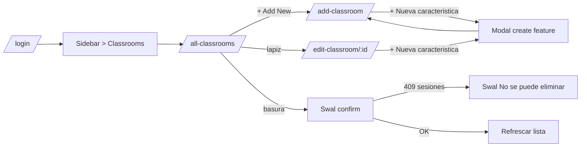

# Frontend — CRUD de aulas y características: casos de prueba y guía de flujo

Guía paso a paso para probar la funcionalidad de **gestión de aulas** del frontend de Planify (carpeta `frontend/`), incluyendo casos felices, validaciones, asociación de **características de aula** (multi-select y modal de creación inline), y el bloqueo de borrado cuando un aula tiene sesiones de clase asignadas.

---

## 1. Alcance

Cubre el flujo completo del CRUD de aulas implementado en el frontend:

- Listar / buscar aulas (paginación + sort por columna).
- Crear, editar y eliminar aulas.
- Configurar las **características** de cada aula (multi-select + modal "+ Nueva característica").
- Validaciones de cliente: `code` (mayúsculas/números/guiones, 2-20 chars), `name` (2-120 chars), `capacity` (entero entre 1 y 1000).
- Validaciones de backend: mismas reglas en TypeScript + bloqueo del `DELETE` cuando hay `class-sessions` ligadas (`code: CLASSROOM_HAS_SESSIONS`).

Páginas y archivos involucrados:

| Página | Ruta | Archivo |
|---|---|---|
| Lista de aulas | `/all-classrooms` | [`frontend/src/jsx/pages/classrooms/AllClassrooms.jsx`](../frontend/src/jsx/pages/classrooms/AllClassrooms.jsx) |
| Crear aula | `/add-classroom` | [`frontend/src/jsx/pages/classrooms/AddClassroom.jsx`](../frontend/src/jsx/pages/classrooms/AddClassroom.jsx) |
| Editar aula | `/edit-classroom/:documentId` | [`frontend/src/jsx/pages/classrooms/EditClassroom.jsx`](../frontend/src/jsx/pages/classrooms/EditClassroom.jsx) |
| Modal "Nueva característica" | (inline) | [`frontend/src/jsx/pages/classrooms/FeatureModal.jsx`](../frontend/src/jsx/pages/classrooms/FeatureModal.jsx) |

Servicios y validaciones:

- [`frontend/src/services/classroomService.js`](../frontend/src/services/classroomService.js) (CRUD HTTP).
- [`frontend/src/services/classroomFeatureService.js`](../frontend/src/services/classroomFeatureService.js) (catálogo de características).
- [`frontend/src/jsx/pages/classrooms/classroomValidation.js`](../frontend/src/jsx/pages/classrooms/classroomValidation.js) (`validateClassroom`, `validateFeature`).

Backend correspondiente:

- [`backend/src/api/classroom/controllers/classroom.ts`](../backend/src/api/classroom/controllers/classroom.ts) (validación + bloqueo de delete).
- [`backend/src/api/classroom/validation/classroom-validation.ts`](../backend/src/api/classroom/validation/classroom-validation.ts) (funciones puras).
- [`backend/src/api/classroom/validation/classroom-validation.test.ts`](../backend/src/api/classroom/validation/classroom-validation.test.ts) (Vitest, 23 tests).
- [`backend/src/api/classroom-feature/controllers/classroom-feature.ts`](../backend/src/api/classroom-feature/controllers/classroom-feature.ts).

---

## 2. Requisitos previos

1. Backend operativo. Seguir [BACKEND-prerrequisitos-y-pruebas.md](BACKEND-prerrequisitos-y-pruebas.md) hasta tener `planify-strapi` y `planify-postgres` arriba.
2. Frontend levantado (vía Docker o local):

```powershell
docker compose up -d --build frontend
```

   o, fuera de Docker, desde `frontend/`:

```powershell
npm install
npm start
```

3. URLs por defecto (con `STRAPI_PORT=1337` y `FRONTEND_PORT=3000`):

| Recurso | URL |
|---|---|
| Frontend | `http://localhost:3000` |
| API Strapi | `http://localhost:1337/api` |
| Login API | `POST http://localhost:1337/api/auth/local` |

4. `frontend/.env.local` debe contener:

```env
REACT_APP_API_URL=http://localhost:1337
```

5. Usuario administrador (rol `academic_coordinator`) seeded por [`backend/src/index.ts`](../backend/src/index.ts):

| Email | Contraseña | Rol |
|---|---|---|
| `coordinator@planify.edu` | `Planify123*` | academic_coordinator |

> Los permisos de CRUD de `classroom` y `classroom-feature` ya están concedidos al rol `academic_coordinator` en el bootstrap (líneas 55-65 de [`backend/src/index.ts`](../backend/src/index.ts)).

### Datos de prueba (seed Postgres)

Para sembrar 6 aulas y 6 características con asociaciones variadas (incluyendo un aula sin features y otra con sesión ligada para probar bloqueo de delete):

```powershell
# Linux/macOS y Git Bash
docker exec -i planify-postgres psql -U strapi -d strapi < scripts/seed-planify-classrooms-test-data.sql

# PowerShell de Windows
Get-Content scripts/seed-planify-classrooms-test-data.sql -Raw | docker exec -i planify-postgres psql -U strapi -d strapi
```

Detalle del script: [`scripts/seed-planify-classrooms-test-data.sql`](../scripts/seed-planify-classrooms-test-data.sql). Es **idempotente**: borra solo las filas con código `PLAN-CLR-SEED-*` / `PLAN-FEAT-SEED-*` y `document_id` `b1000000-...`, así que se puede re-ejecutar sin afectar otros datos.

Resumen de lo que siembra:

| Code aula | Nombre | Capacity | Activa | Características |
|---|---|---|---|---|
| `PLAN-CLR-SEED-001` | Aula Magna | 120 | sí | Proyector + AC + Audiovisual |
| `PLAN-CLR-SEED-002` | Aula Foro | 45 | sí | Proyector + AC |
| `PLAN-CLR-SEED-003` | Lab Sistemas | 30 | sí | Proyector + AC + Lab cómputo + Pizarra digital |
| `PLAN-CLR-SEED-004` | Lab Biologia | 24 | sí | AC + Microscopios |
| `PLAN-CLR-SEED-005` | Aula chica | 20 | sí | (sin características — útil para probar UI vacía) |
| `PLAN-CLR-SEED-006` | Aula Inactiva | 15 | **no** | Proyector — además tiene 1 sesión ligada para probar bloqueo de delete |

---

## 3. Mapa de la UI



La sidebar tiene el grupo **Classrooms** con:

- **All Classrooms** → `/all-classrooms`
- **Add Classroom** → `/add-classroom`

---

## 4. Casos de prueba

Convenciones:

- **Pasos**: lista numerada de acciones del usuario.
- **Esperado**: lo que la UI debe hacer (mensajes en español, navegación, persistencia).
- Tras cada caso se sugiere una **verificación por API** opcional con curl/Postman (`Authorization: Bearer <jwt>` → ver paso 4 de [README-validacion-y-endpoints.md](README-validacion-y-endpoints.md)).

---

### Caso 1 — Listar aulas, buscar y paginar

**Precondición**: haber corrido el seed (sección 2).

**Pasos**:

1. Login como `coordinator@planify.edu` / `Planify123*`.
2. Sidebar → **Classrooms → All Classrooms**.
3. Verifica las columnas: Código, Nombre, Capacidad, Características, Estado, Acciones.
4. Escribe `LAB` en el search box.
5. Cambia el `Show 10/20/30 entries` y observa la paginación.
6. Haz click en el header "Capacidad" (toggle de orden ascendente/descendente).

**Esperado**:

- Aparecen las 6 aulas seed más cualquiera adicional.
- El aula `PLAN-CLR-SEED-005` (Aula chica) muestra `—` en la columna Características.
- La fila inactiva (`PLAN-CLR-SEED-006`) muestra el badge gris "Inactiva".
- El search filtra por código, nombre, capacidad o nombre/code de característica.
- El sort por columna funciona en ambas direcciones.

---

### Caso 2 — Crear aula desde el formulario

**Pasos**:

1. En `/all-classrooms`, click **+ Add New**.
2. Llenar:
   - Código: `AULA-DEMO`
   - Nombre: `Aula de demostración`
   - Capacidad: `40`
   - Estado: marcado como Activa.
   - Características: selecciona Proyector y AC.
3. Submit.

**Esperado**:

- Swal de éxito ("Aula creada"), redirección a `/all-classrooms`.
- En la lista aparece la fila nueva con los badges `Proyector HDMI` y `Aire acondicionado`.

---

### Caso 3 — Crear característica desde el modal inline

**Pasos**:

1. En `/add-classroom` (o `/edit-classroom/:id`), clic en **+ Nueva característica**.
2. Llenar el modal:
   - Código: `WHITEBOARD`
   - Nombre: `Tablero blanco`
3. Crear.

**Esperado**:

- Swal de éxito ("Característica creada"), modal se cierra.
- El multi-select del aula se recarga y la nueva característica aparece **ya seleccionada**.
- Si guardas el aula, queda con la nueva característica asociada.

---

### Caso 4 — Editar un aula

**Pasos**:

1. En `/all-classrooms`, ícono lápiz sobre `PLAN-CLR-SEED-002` (Aula Foro).
2. Cambia capacidad a `60`, agrega la característica "Sala audiovisual", desmarca Activa.
3. Submit.

**Esperado**:

- Swal "Aula actualizada", regreso a la lista.
- La fila refleja capacidad 60, badge "Audiovisual" extra y badge gris "Inactiva".

---

### Caso 5 — Eliminar un aula sin sesiones (caso feliz)

**Pasos**:

1. En `/all-classrooms`, basura sobre `PLAN-CLR-SEED-005` (Aula chica, sin sesiones).
2. Confirmar el Swal.

**Esperado**:

- Swal "Eliminada".
- La fila desaparece de la tabla.

**Verificación por API**:

```http
GET http://localhost:1337/api/classrooms/b1000000-0001-4000-8000-000000000105
Authorization: Bearer <jwt-coordinator>
```

Debe responder `404`.

---

### Caso 6 — Eliminar un aula CON sesiones (bloqueo)

**Pasos**:

1. En `/all-classrooms`, basura sobre `PLAN-CLR-SEED-006` (Aula Inactiva — el seed le adjunta una sesión).
2. Confirmar el Swal.

**Esperado**:

- Swal **"No se puede eliminar"** con mensaje:
  > "No se puede eliminar el aula porque tiene sesiones de clase asignadas. Reasigna o elimina primero las sesiones."
- La fila **sigue** en la tabla.

**Verificación por API**:

```http
DELETE http://localhost:1337/api/classrooms/b1000000-0001-4000-8000-000000000106
Authorization: Bearer <jwt-coordinator>
```

Debe responder `400` con `error.details.code = "CLASSROOM_HAS_SESSIONS"`.

---

### Caso 7 — Validación: código inválido

**Pasos**:

1. `/add-classroom`, código `aula 101` (con minúsculas y espacios).
2. Submit.

**Esperado**:

- Swal "Datos inválidos — El código debe tener entre 2 y 20 caracteres y sólo letras mayúsculas, números o guiones."
- No se hace POST.

**Variantes**:

- Código vacío → "El código es obligatorio."
- Código `A` → mismo error de formato.
- Código `A`*21 → mismo error.

> Pista: el campo `code` del formulario hace `toUpperCase()` automáticamente al tipear, así que casos como "aula-101" se autocorrigen. La validación es una segunda barrera contra entradas pegadas.

---

### Caso 8 — Validación: nombre obligatorio / muy largo

**Pasos**:

1. `/add-classroom`, nombre vacío → Swal "El nombre es obligatorio."
2. Pegar un nombre de 121 caracteres → Swal "El nombre no puede superar 120 caracteres."

---

### Caso 9 — Validación: capacidad fuera de rango

**Pasos**:

1. `/add-classroom`, capacidad `0` → Swal "La capacidad debe ser al menos 1."
2. Capacidad `1001` → Swal "La capacidad no puede superar 1000."
3. Capacidad `treinta` (escrito vía dev tools, ya que el `<input type="number">` filtra) → Swal "La capacidad debe ser un número entero."

---

### Caso 10 — Aula sin características

**Pasos**:

1. `/add-classroom`, deja el multi-select vacío.
2. Submit.

**Esperado**:

- Se crea sin error (las features son opcionales).
- En `/all-classrooms` la columna Características muestra `—`.

---

### Caso 11 — Errores del backend

**Pasos**:

1. Apaga Strapi: `docker compose stop strapi`.
2. Intenta listar/crear desde el frontend.

**Esperado**:

- Swal de error con el mensaje del backend o "Unexpected error".
- La UI no queda colgada.

---

## 5. Resumen rápido de validaciones

### Cliente (frontend)

| Regla | Mensaje |
|---|---|
| `code` ausente | "El código es obligatorio." |
| `code` no cumple `[A-Z0-9-]{2,20}` | "El código debe tener entre 2 y 20 caracteres y sólo letras mayúsculas, números o guiones." |
| `name` ausente | "El nombre es obligatorio." |
| `name` < 2 chars | "El nombre debe tener al menos 2 caracteres." |
| `name` > 120 chars | "El nombre no puede superar 120 caracteres." |
| `capacity` ausente | "La capacidad es obligatoria." |
| `capacity` no numérico | "La capacidad debe ser un número entero." |
| `capacity < 1` | "La capacidad debe ser al menos 1." |
| `capacity > 1000` | "La capacidad no puede superar 1000." |

### Backend (mismas reglas + bloqueo de delete)

| Endpoint | Validación extra |
|---|---|
| `DELETE /api/classrooms/:id` | Si hay `class-sessions` con `classroom = :id`, devuelve `400` con `error.details.code = "CLASSROOM_HAS_SESSIONS"`. |

Estas validaciones viven en [`backend/src/api/classroom/validation/classroom-validation.ts`](../backend/src/api/classroom/validation/classroom-validation.ts), con cobertura de tests Vitest:

```bash
cd backend
npm test
```

Resultado esperado: **50 tests pasando** (las 23 de classroom + las 27 de session).

---

## 6. Verificación cruzada con la API

Tras cada operación en la UI, se puede confirmar el estado real con:

```http
# Listar (con features)
GET http://localhost:1337/api/classrooms?populate=features
Authorization: Bearer <jwt>

# Detalle
GET http://localhost:1337/api/classrooms/<documentId>?populate=features
Authorization: Bearer <jwt>

# Crear
POST http://localhost:1337/api/classrooms
Authorization: Bearer <jwt>
Content-Type: application/json

{
  "data": {
    "code": "AULA-DEMO",
    "name": "Aula de demostración",
    "capacity": 40,
    "isActive": true,
    "features": { "set": [{ "documentId": "<featureDocId>" }] }
  }
}

# Actualizar
PUT http://localhost:1337/api/classrooms/<documentId>
Authorization: Bearer <jwt>
Content-Type: application/json

{
  "data": {
    "capacity": 60,
    "isActive": false,
    "features": { "set": [
      { "documentId": "<featDocId1>" },
      { "documentId": "<featDocId2>" }
    ] }
  }
}

# Eliminar
DELETE http://localhost:1337/api/classrooms/<documentId>
Authorization: Bearer <jwt>

# Listar features (catálogo)
GET http://localhost:1337/api/classroom-features
Authorization: Bearer <jwt>

# Crear feature (desde modal inline o curl)
POST http://localhost:1337/api/classroom-features
Authorization: Bearer <jwt>
Content-Type: application/json

{
  "data": { "code": "WHITEBOARD", "name": "Tablero blanco" }
}
```

Para obtener `<jwt>`:

```http
POST http://localhost:1337/api/auth/local
Content-Type: application/json

{ "identifier": "coordinator@planify.edu", "password": "Planify123*" }
```

---

## 7. Problemas frecuentes

| Síntoma | Causa probable | Solución |
|---|---|---|
| El frontend muestra `Unexpected error` al cargar `/all-classrooms` | Strapi caído o `REACT_APP_API_URL` mal configurado | `docker compose ps` y revisar `frontend/.env.local`. Tras cambios reinicia el frontend. |
| Login OK pero la tabla queda vacía | Token expirado o usuario sin permisos `api::classroom.classroom.find` | Volver a iniciar sesión; verificar permisos del rol en Strapi admin (deberían venir del bootstrap). |
| El multi-select no muestra ninguna característica | Catálogo vacío | Correr el seed o crear una característica desde el modal "+ Nueva característica". |
| El delete no falla pese a que el aula "tiene" sesiones | Las sesiones están sin `published_at` o sin link en `class_sessions_classroom_lnk` | Re-correr el seed; el backend filtra por sesiones publicadas. |
| El badge de característica en la tabla no se actualiza tras editar | Caché de React; falta refresh | El back devuelve el aula con `populate=features` tras update; el `fetchClassrooms()` se llama al volver a la lista. Si pasa, recargar la página. |

---

## 8. Pruebas de regresión sugeridas (smoke test)

Lista mínima para considerar que la feature está OK tras un cambio:

- [ ] Login coordinator → ver lista, buscar por código y por nombre de característica.
- [ ] Crear aula con 0, 1 y N características.
- [ ] Crear característica desde el modal inline durante un add → queda preseleccionada.
- [ ] Editar capacidad y estado → se refleja en la lista.
- [ ] Eliminar `PLAN-CLR-SEED-005` (sin sesiones) → desaparece y devuelve 404 vía API.
- [ ] Eliminar `PLAN-CLR-SEED-006` (con sesión) → Swal "No se puede eliminar" + 400 vía API.
- [ ] `npm test` desde `backend/` → 50 tests pasando.

---

## 9. Documentación relacionada

- [BACKEND-prerrequisitos-y-pruebas.md](BACKEND-prerrequisitos-y-pruebas.md) — levantar Strapi/Postgres y usuarios seed.
- [README-frontend-disponibilidad-docente.md](README-frontend-disponibilidad-docente.md) — patrón base para CRUD del frontend.
- [README-validacion-y-endpoints.md](README-validacion-y-endpoints.md) — referencia general de validaciones backend.
