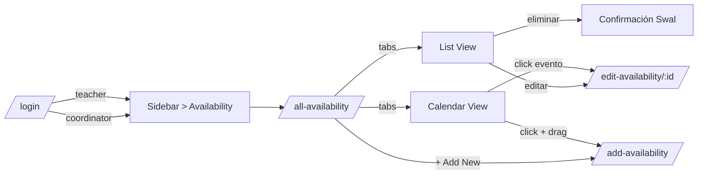

# Frontend — CRUD de disponibilidad docente: casos de prueba y guía de flujo

Guía paso a paso para probar la funcionalidad de **disponibilidad docente** del frontend de Planify (rama `frontend/`), incluyendo casos felices, validaciones, soporte multi-rol (`academic_coordinator` y `teacher`) y verificación cruzada por API.

---

## 1. Alcance

Cubre el flujo completo del CRUD de disponibilidad docente implementado en el frontend:

- Listar / filtrar rangos de disponibilidad por docente.
- Crear rangos desde un formulario clásico **o** desde un calendario semanal (drag & drop).
- Editar / eliminar rangos existentes.
- Validaciones de cliente: día (1–6), formato `HH:MM`, `endTime > startTime`, sin solapamientos.
- Vista coordinador (con selector de docente) y vista autoservicio para el docente logueado.

Páginas y archivos involucrados:

| Página | Ruta | Archivo |
|---|---|---|
| Lista + Calendario | `/all-availability` | [`frontend/src/jsx/pages/availabilities/AllAvailability.jsx`](../frontend/src/jsx/pages/availabilities/AllAvailability.jsx) |
| Crear rango | `/add-availability` | [`frontend/src/jsx/pages/availabilities/AddAvailability.jsx`](../frontend/src/jsx/pages/availabilities/AddAvailability.jsx) |
| Editar rango | `/edit-availability/:documentId` | [`frontend/src/jsx/pages/availabilities/EditAvailability.jsx`](../frontend/src/jsx/pages/availabilities/EditAvailability.jsx) |

Servicios y validaciones:

- [`frontend/src/services/availabilityService.js`](../frontend/src/services/availabilityService.js) (CRUD HTTP).
- [`frontend/src/jsx/pages/availabilities/availabilityValidation.js`](../frontend/src/jsx/pages/availabilities/availabilityValidation.js) (`validateRange`, `findOverlap`, `parseTime`).

---

## 2. Requisitos previos

1. Backend operativo. Seguir [BACKEND-prerrequisitos-y-pruebas.md](BACKEND-prerrequisitos-y-pruebas.md) hasta tener `planify-strapi` y `planify-postgres` arriba.
2. Frontend levantado (vía Docker o local):

```powershell
docker compose up -d --build frontend
```

   o, fuera de Docker, desde `frontend/`:

```powershell
npm install
npm start
```

3. URLs por defecto (asumiendo `STRAPI_PORT=1337` y `FRONTEND_PORT=3000` en la raíz `.env`):

| Recurso | URL |
|---|---|
| Frontend | `http://localhost:3000` |
| API Strapi | `http://localhost:1337/api` |
| Login API | `POST http://localhost:1337/api/auth/local` |

4. `frontend/.env.local` debe contener:

```env
REACT_APP_API_URL=http://localhost:1337
```

5. Usuarios de prueba seeded por `backend/src/index.ts`:

| Email | Contraseña | Rol |
|---|---|---|
| `coordinator@planify.edu` | `Planify123*` | academic_coordinator |
| `teacher@planify.edu` | `Planify123*` | teacher |
| `student@planify.edu` | `Planify123*` | student |

> **Importante para el modo `teacher`**: se requiere que exista un registro `teacher` cuyo `email` coincida con el del usuario logueado para que la página resuelva su `documentId`. Si no existe, la página cae al modo coordinador (selector de docente).
>
> **Forma rápida de cargar datos de prueba** (incluye un docente con `email = teacher@planify.edu`, otros 2 docentes y 9 rangos pensados para los casos de prueba de abajo):
>
> ```powershell
> docker exec -i planify-postgres psql -U strapi -d strapi < scripts/seed-planify-availability-test-data.sql
> ```
>
> Detalle del script: [`scripts/seed-planify-availability-test-data.sql`](../scripts/seed-planify-availability-test-data.sql). Es idempotente: borra solo las filas marcadas con código `PLAN-AV-SEED-*` y `document_id` `a1000000-...`, así que se puede re-ejecutar sin afectar otros datos. Si prefieres alta manual, también puedes crear el docente desde `/add-professor` o desde el admin de Strapi.

---

## 3. Mapa de la UI



La sidebar tiene el grupo **Availability** con:

- **All Availabilities** → `/all-availability`
- **Add Availability** → `/add-availability`

---

## 4. Casos de prueba

Convenciones:

- **Pasos**: lista numerada de acciones del usuario.
- **Esperado**: lo que la UI debe hacer (mensajes en español, navegación, persistencia).
- Las **horas** se introducen con el `<input type="time">` HTML5 nativo. En Chrome/Edge se ven como `08:00 a. m.`; el valor enviado es `HH:MM`.
- Tras cada caso se sugiere una **verificación por API** opcional con curl/Postman (`Authorization: Bearer <jwt>` → ver paso 4 de [README-validacion-y-endpoints.md](README-validacion-y-endpoints.md)).

---

### Caso 1 — Coordinador: listar y filtrar disponibilidad por docente

**Precondición**: existir al menos 1 docente con disponibilidad. Si no existe ninguna, sigue primero el caso 2 o 3.

**Pasos**:

1. Login como `coordinator@planify.edu` / `Planify123*`.
2. Sidebar → **Availability → All Availabilities**.
3. En la pestaña **List View** se muestra una tabla con columnas: Docente, Día, Hora inicio, Hora fin, Disponible, Acciones.
4. En el card "Filtrar por docente", abre el `react-select` y elige un docente.
5. Cambia a la pestaña **Calendar View**.

**Esperado**:

- En List View aparecen todos los rangos del docente seleccionado (o todos los docentes si no hay filtro).
- El search box filtra por nombre del docente, día o rango horario.
- El `Show 10/20/30 entries` y la paginación funcionan.
- En Calendar View se ve una rejilla semanal de Lunes a Sábado (sin Domingo) entre 06:00 y 22:00, con los rangos en verde (`isAvailable=true`) o gris (`isAvailable=false`).

**Verificación por API**:

```http
GET http://localhost:1337/api/availabilities?populate=teacher&filters[teacher][documentId][$eq]=<documentId>
Authorization: Bearer <jwt-coordinator>
```

---

### Caso 2 — Coordinador: crear rango desde el formulario `/add-availability`

**Pasos**:

1. En `/all-availability` clic en **+ Add New**.
2. Se abre `/add-availability` con el selector de docente visible.
3. Selecciona un docente, deja el día en `Lunes`, hora inicio `08:00`, hora fin `10:00`, marca `Disponible`.
4. Clic en **Submit**.

**Esperado**:

- Swal de éxito ("Disponibilidad creada").
- Redirección automática a `/all-availability`.
- En List View aparece la fila nueva. En Calendar View se ve un bloque verde el lunes 08:00–10:00.

**Verificación por API**:

```http
GET http://localhost:1337/api/availabilities?populate=teacher
Authorization: Bearer <jwt-coordinator>
```

Debe incluir el slot recién creado con `teacher.documentId` correcto.

---

### Caso 3 — Coordinador: crear rango desde el calendario (drag & drop)

**Pasos**:

1. En `/all-availability`, opcional: filtra por un docente.
2. Pestaña **Calendar View**.
3. Haz clic-arrastre desde `Martes 14:00` hasta `Martes 16:00`.

**Esperado**:

- Redirección a `/add-availability?day=2&start=14:00&end=16:00&teacher=<documentId>` (este último parámetro solo si había filtro de docente).
- El formulario llega con el día y horas precargadas; si había filtro, también el docente.
- Tras Submit, vuelve a `/all-availability` y el bloque aparece en el calendario.

---

### Caso 4 — Coordinador: editar un rango existente

**Pasos** (vía List View):

1. En `/all-availability`, fila objetivo → ícono lápiz.
2. Cambia hora inicio a `09:00` y hora fin a `11:00`.
3. Submit.

**Pasos alternativos** (vía Calendar View):

1. Click sobre el bloque del rango → navega a `/edit-availability/:documentId`.

**Esperado**:

- Swal de éxito ("Disponibilidad actualizada"), regreso a `/all-availability`.
- El rango actualizado se refleja inmediatamente.

---

### Caso 5 — Coordinador: eliminar un rango

**Pasos**:

1. En List View, fila objetivo → ícono basura roja.
2. Confirmar en el diálogo Swal "¿Eliminar disponibilidad?".

**Esperado**:

- Swal "Eliminada", la fila desaparece de la tabla y del calendario.

**Verificación por API**:

```http
GET http://localhost:1337/api/availabilities/<documentId>
Authorization: Bearer <jwt-coordinator>
```

Debe responder `404`.

---

### Caso 6 — Docente autoservicio (`teacher@planify.edu`)

**Precondición**: existir un registro `teacher` con `email = teacher@planify.edu`.

**Pasos**:

1. Login como `teacher@planify.edu`.
2. Sidebar → **Availability → All Availabilities**.

**Esperado**:

- **No** aparece el card "Filtrar por docente".
- En su lugar, alert info "Mostrando la disponibilidad de **Nombre Apellido**".
- La tabla y el calendario solo muestran sus propios rangos.
- Al crear (`/add-availability`) el campo "Docente" aparece como input deshabilitado con su nombre, **sin** selector. El docente queda fijado a su `documentId`.
- Al editar `/edit-availability/<id>` de **otro docente** (ej. modificando manualmente la URL), aparece Swal "Acceso restringido" y redirige a `/all-availability`.

---

### Caso 7 — Validación: día fuera de rango

**Pasos**:

1. Abrir `/add-availability`.
2. Manualmente vía URL: `/add-availability?day=7&start=08:00&end=10:00`.

**Esperado**:

- El selector de día se queda vacío (porque 7 no es opción).
- Si seleccionas un día válido pero envías sin elegir, el Swal indica "El día debe ser un valor entre 1 (Lunes) y 6 (Sábado)."

> Nota: el `<select>` solo ofrece Lunes–Sábado, así que esta validación es defensa adicional ante prefill malicioso.

---

### Caso 8 — Validación: hora fin <= hora inicio

**Pasos**:

1. `/add-availability`, hora inicio `10:00`, hora fin `08:00`.
2. Submit.

**Esperado**:

- Swal "Rango inválido — La hora de fin debe ser mayor que la hora de inicio."
- No se llama a la API.

**Variante**: hora inicio `10:00` igual a hora fin `10:00` → mismo error.

---

### Caso 9 — Validación: solapamiento

**Precondición**: el docente X ya tiene un rango Lunes 08:00–10:00.

**Pasos**:

1. Crear otro rango para X: Lunes 09:00–11:00.

**Esperado**:

- Swal "Solapamiento detectado — El docente ya tiene un rango el Lunes entre 08:00 y 10:00."
- Persistencia: ningún POST se ejecuta.

**Variantes que NO solapan** (deben pasar):

- Lunes 10:00–12:00 (borde exacto, no solapa).
- Martes 09:00–11:00 (otro día).
- Otro docente, mismo día y rango.

**Caso editar sin tocar el horario**: editar un rango existente y guardar sin cambiar nada → debe funcionar, porque `findOverlap` excluye el `excludeDocumentId` actual.

---

### Caso 10 — Validación: campos obligatorios

**Pasos**:

1. `/add-availability` sin seleccionar docente (siendo coordinador).
2. Submit.

**Esperado**:

- Swal "Falta el docente — Selecciona un docente antes de continuar."

**Variante**: vaciar manualmente la hora con `<input type="time">` y enviar → el navegador bloquea con `required` o Swal "La hora de inicio es obligatoria.".

---

### Caso 11 — Errores del backend

**Pasos**:

1. Apaga Strapi (`docker compose stop strapi`).
2. Intenta listar/crear desde el frontend.

**Esperado**:

- Swal de error con el mensaje del backend o "Unexpected error".
- La UI no queda colgada.

---

### Caso 12 — Permisos: rol `student`

**Pasos**:

1. Login como `student@planify.edu`.
2. Navega a `/all-availability`.

**Esperado**:

- La API devuelve **403** (`student` no tiene `api::availability.availability.find`).
- El frontend muestra Swal "Error" y la tabla queda vacía.

> Esto es comportamiento esperado: el rol `student` no debe gestionar disponibilidad. La protección real está en el backend.

---

## 5. Resumen rápido de validaciones (cliente)

| Regla | Mensaje |
|---|---|
| `dayOfWeek` ∉ [1, 6] | "El día debe ser un valor entre 1 (Lunes) y 6 (Sábado)." |
| `startTime` vacío | "La hora de inicio es obligatoria." |
| `endTime` vacío | "La hora de fin es obligatoria." |
| Formato no `HH:MM` | "La hora de inicio/fin tiene un formato inválido (use HH:MM)." |
| `endTime <= startTime` | "La hora de fin debe ser mayor que la hora de inicio." |
| Solapamiento con otro rango del mismo docente y día | "Solapamiento detectado — El docente ya tiene un rango el {día} entre {HH:MM} y {HH:MM}." |
| Sin docente seleccionado (coordinador) | "Falta el docente — Selecciona un docente antes de continuar." |

Definición de solapamiento: intervalos abiertos. `[08:00, 10:00)` y `[10:00, 12:00)` **NO** solapan. `[08:00, 10:00)` y `[09:00, 11:00)` **SÍ** solapan. Misma regla que [`isTimeOverlap`](../backend/src/api/class-session/validation/session-validation.ts) del backend.

---

## 6. Verificación cruzada con la API

Tras cada operación en la UI, se puede confirmar el estado real con:

```http
# Listar
GET http://localhost:1337/api/availabilities?populate=teacher
Authorization: Bearer <jwt>

# Filtrar por docente
GET http://localhost:1337/api/availabilities?populate=teacher&filters[teacher][documentId][$eq]=<docId>
Authorization: Bearer <jwt>

# Detalle
GET http://localhost:1337/api/availabilities/<documentId>?populate=teacher
Authorization: Bearer <jwt>

# Crear
POST http://localhost:1337/api/availabilities
Authorization: Bearer <jwt>
Content-Type: application/json

{
  "data": {
    "dayOfWeek": 1,
    "startTime": "08:00",
    "endTime": "10:00",
    "isAvailable": true,
    "teacher": { "connect": [{ "documentId": "<teacherDocId>" }] }
  }
}

# Actualizar
PUT http://localhost:1337/api/availabilities/<documentId>
Authorization: Bearer <jwt>
Content-Type: application/json

{
  "data": {
    "dayOfWeek": 1,
    "startTime": "09:00",
    "endTime": "11:00",
    "isAvailable": true
  }
}

# Eliminar
DELETE http://localhost:1337/api/availabilities/<documentId>
Authorization: Bearer <jwt>
```

Para obtener `<jwt>`:

```http
POST http://localhost:1337/api/auth/local
Content-Type: application/json

{ "identifier": "coordinator@planify.edu", "password": "Planify123*" }
```

---

## 7. Problemas frecuentes

| Síntoma | Causa probable | Solución |
|---|---|---|
| El frontend muestra `Unexpected error` al cargar `/all-availability` | Strapi caído o `REACT_APP_API_URL` mal configurado | `docker compose ps` y revisar `frontend/.env.local`. Tras cambios reinicia el frontend. |
| Login OK pero la tabla queda vacía aunque hay datos | Token expirado o usuario sin permisos | Volver a iniciar sesión; verificar permisos del rol en Strapi admin. |
| Como `teacher`, la página entra en modo coordinador | No existe registro `teacher` con `email = teacher@planify.edu` | Crear el docente desde `/add-professor` con ese email exacto. |
| El docente puede llegar a `/edit-availability/<id-ajeno>` y no se redirige | El servicio devuelve `null` si el backend bloquea por permisos; en ese caso la UI redirige a `/all-availability` con o sin Swal | Verificar permisos `api::availability.availability.findOne` en el rol Teacher. |
| El calendario no muestra eventos pero la tabla sí | El `dayOfWeek` o las horas tienen formato inesperado (ej. nulos) | Inspeccionar payload con la API y corregir vía List View. |
| El drag en el calendario no precarga horas en Add | Cookies bloquean `useSearchParams` (caso muy raro) | Ver consola del navegador; revisar que la URL tenga `?day=...&start=...&end=...`. |

---

## 8. Pruebas de regresión sugeridas (smoke test)

Lista mínima para considerar que la feature está OK tras un cambio:

- [ ] Login coordinator → ver lista, filtrar por docente, crear, editar y eliminar.
- [ ] Drag en calendario crea con prefill correcto.
- [ ] Validación de solapamiento bloquea (caso 9).
- [ ] Validación de `end <= start` bloquea (caso 8).
- [ ] Login teacher → solo ve lo suyo, sin selector.
- [ ] Teacher intentando editar slot ajeno → redirección con Swal.
- [ ] Eliminar funciona y se refleja en API (`GET` 404).

---

## 9. Documentación relacionada

- [BACKEND-prerrequisitos-y-pruebas.md](BACKEND-prerrequisitos-y-pruebas.md) — levantar Strapi/Postgres y usuarios seed.
- [README-endpoints-sesiones-y-reglas.md](README-endpoints-sesiones-y-reglas.md) — endpoints custom y datos seed para Postman.
- [README-validacion-y-endpoints.md](README-validacion-y-endpoints.md) — validaciones backend de sesiones y reglas (referencia para `isTimeOverlap`).
